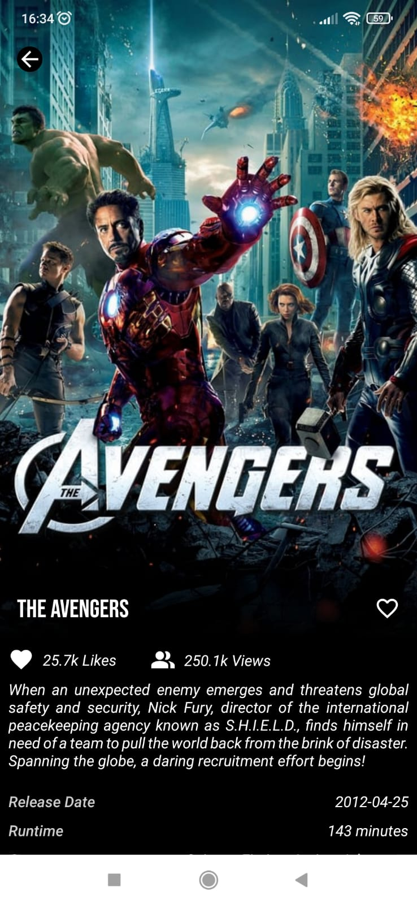

# Desafio - Filmes :movie_camera::vhs:

O desafio consistia em criar um app que se assemelhasse a tela de informações do filme do app [TodoMovies]([‎TodoMovies na App Store (apple.com)](https://apps.apple.com/br/app/todomovies-4/id792499896)) .

    

      
       
 Screenshot de referência 

    

    

           
        
Screenshot do meu app

    

Para obter as informações sobres os filmes, foi pedido que utilize a api do site [The Movie Database]([API Docs (themoviedb.org)](https://developers.themoviedb.org/3/getting-started/introduction))

 
    

## Requisitos do projeto

- [x] Usar alguma arquitetura : Clean + MVVM .
- [x] Receber as informações através do endpoint [getMovieDetails](https://developers.themoviedb.org/3/movies/get-movie-details).
- [x] Usar o vote_count que retorna da API para representar o número de likes.
- [x] Substituir o “3 of 10 watched” por “ views”, utilizando o valor retornado da API e mantendo algum ícone ao lado.
- [x] O ícone de like (coração) deve mudar quando clicado, alternando entre preenchido e vazio.
- [x] Deve haver uma lista de filmes abaixo dos detalhes.
- [x] Utilizar os métodos (GET,POST,PUT,PATCH,DELETE)
- [x] O app deve ser desenvolvido utilizando a linguagem Kotlin.
- [x] O projeto deve ser disponibilizado em um repositório aberto no GitHub. Envie a URL assim que possível.

## Tecnologias utilizadas

* CoordinatorLayout + CollapsingToolbarLayout para exibir o cartaz de cada filme.

- Injeção de dependências com Koin.

- Retrofit para requisições da API.

- RecyclerView com ListAdapter para exibição de listas.

  

## Resultado

[Acesse aqui o link para o vídeo no youtube, contendo o resultado final do app:](https://www.youtube.com/shorts/FzlaP0FybDc)

Estou bem satisfeito com o resultado final, consegui fazer a maioria do que pretendia fazer desde o começo do projeto, com mais tempo gostaria de aprender a usar o DataStore para cachear alguma informações da api em que utilizei enums, como Lista de Gêneros de filmes, e configurações para a exibição de imagens, assim também como uma sessão que mostrassem o diretor e diretores envolvidos em cada filme.

    

      
       
Collapsing Toolbar

    

    

           
        	
Lista de Filmes

    

   	

   	       
   	    	
Carregando um Filme da lista no Layout

   	

   	

Consegui também adicionar funções que não foram solicitadas, como conseguir carregar os filmes da lista de similares, e utilizar tela de carregamentos. Mas gostaria mesmo de ter utilizado o Jetpack Navigation para fazer pelo menos mais uma tela, para pesquisa de filmes pelo nome, utilizando o endpoint [search/movie]([The Movie Database API (themoviedb.org)](https://developers.themoviedb.org/3/search/search-movies)).
